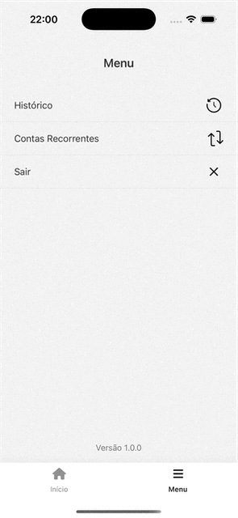
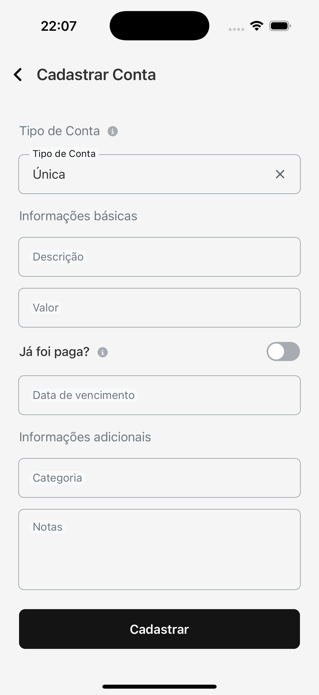
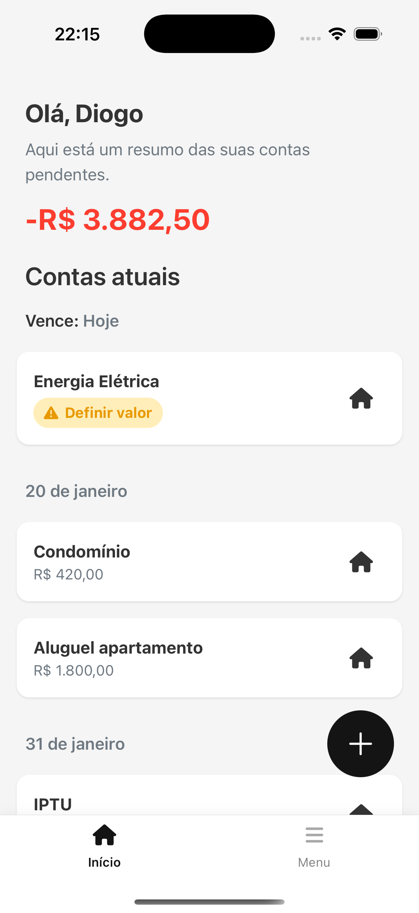
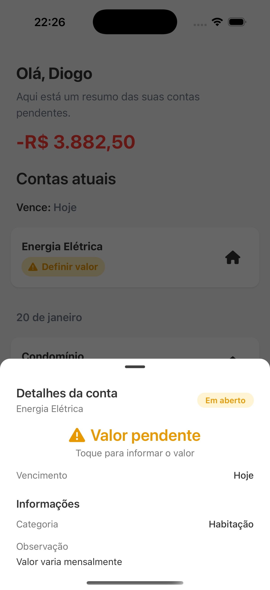
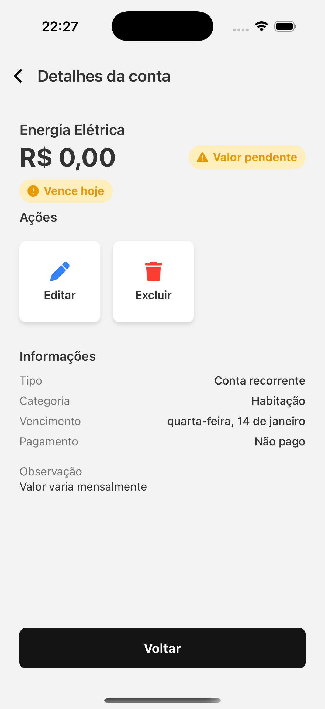
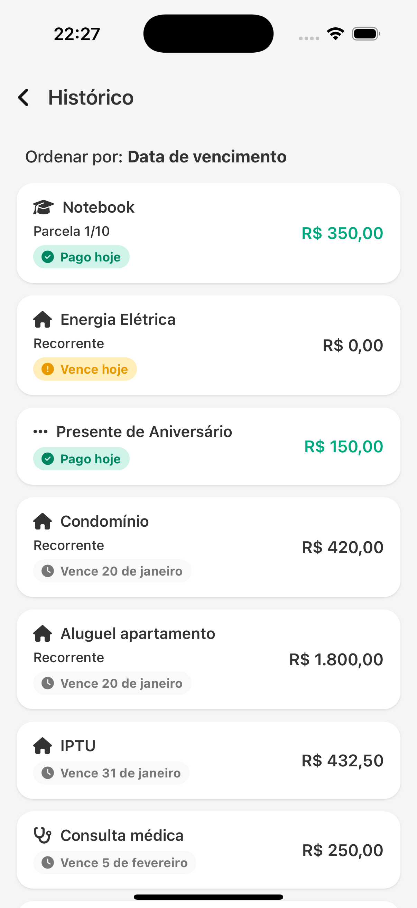

# DinHero 💸🦸‍♂️

### Your financial hero for bills you can’t forget

  
  
  

  

    
    
    
    
    
  

---

## Overview

DinHero is a cross-platform application designed to reduce the mental overhead of managing bills and financial obligations.

Instead of trying to be a full personal finance solution, DinHero deliberately limits its scope to **one core problem**:

> 💡 **_knowing what you need to pay, when you need to pay it, and removing it from your mind once it’s done._**

This repository represents an **end-to-end product**, fully designed, implemented, and published by a single engineer. From ideation and prototyping to architecture, animations, and store delivery.

---

## The Problem

Managing bills can be stressful and cognitively expensive.

People don’t forget bills because they are careless, they forget because financial apps tend to:

- Mix income, expenses, investments, and reports in the same place
- Force users to manually recreate recurring information
- Provide long-term charts when the real anxiety is short-term obligations

DinHero focuses exclusively on **upcoming bills**, optimizing for clarity, predictability, and mental relief.

---

## Core Concept

DinHero is **not** a finance tracker.

It is a **bill management system** centered around:

- Short-term visibility (next 30 days)
- Explicit obligations
- Active removal of mental load once a bill is paid

The reduced scope is intentional and enables:

- Clear domain modeling
- Simple mental model for users
- High-quality end-to-end execution

---

## Key Features

### Upcoming Bills (Next 30 Days)

  

The Home screen displays all unpaid bills due within the next 30 days, grouped by due date.  
This ensures the user only sees what actually matters **right now**.

---

### Swipe to Mark as Paid

  

Bills can be marked as paid using a _swipe gesture_.  
This interaction is intentionally physical and explicit, reinforcing the idea of _closing_ an obligation and removing it from cognitive space.

---

### Bill Creation with Smart Types

  
  
  
  

DinHero supports three distinct bill types, each modeled with its own logic:

#### Single

- One-time payments
- Optional immediate payment marking
- Useful for historical or ad-hoc tracking

Examples: medical appointment, one-time purchase, occasional fee.

#### Installment

- Fixed number of payments
- Automatically generates **N bills**
- Correctly distributes due dates across months

Examples: credit card installments, short-term financing.

#### Recurring

- Bills that repeat monthly with no predefined end date
- Backed by a **Recurring Rule** entity
- Bills are generated automatically over time

Examples: rent, utilities, subscriptions, condominium fees.

---

### Recurring Rules Engine

  

Recurring bills are driven by **rules**, not duplication.

Each rule defines:

- Day of month
- Category
- Optional fixed amount
- Active/inactive state

The system periodically checks these rules and generates new bills when appropriate.

---

### Pending Amounts for Real-World Variability

  
  
  

Some recurring bills don’t have a fixed amount.  
DinHero allows recurring bills to be created with a **null amount**, explicitly marking them as pending.

This mirrors real life and avoids fake precision.

---

### Full History

  

The History section provides full visibility and control:

- Paid, unpaid, overdue, and upcoming bills
- Sorting and filtering
- Full CRUD operations

---

## Authentication & Persistence

  
  

DinHero uses Firebase Authentication for user access and persistence, enabling:

- Secure login
- Isolated user data
- Cloud-backed state

---

## Architecture & Technical Decisions

DinHero was built with a strong emphasis on **domain clarity and long-term maintainability**.

Key areas covered in detail:

- Domain modeling (Bills, RecurringRules)
- State management strategy
- Date handling and normalization
- Animation layer decisions
- Trade-offs and intentionally excluded features

<!-- TODO: verify -->
<!-- 📄 **Detailed documentation:**   -->
<!-- See [`/docs/ARCHITECTURE.md`](./docs/ARCHITECTURE.md) -->

---

## End-to-End Ownership

This project was fully executed end to end:

- Product ideation
- UX flows and prototyping
- Visual design
- Domain modeling
- React Native implementation
- Native animations
- Authentication and persistence
- Android build and Play Store preparation

DinHero exists as a **complete product**, not a demo or tutorial artifact.

---

## Roadmap (Intentional and Limited)

- Improved notification system
- Backup/export options
- Light theming customization
- Performance optimizations

No plans to expand into full financial tracking.  
Scope discipline is a feature.

---

## License

This project is open source and available under the MIT License.

---

## Final Note

DinHero is intentionally small in scope and large in intent.

It demonstrates:

- Product thinking
- Engineering ownership
- Mobile-first execution
- Respect for user cognition

The app does less — on purpose — and does it well.
